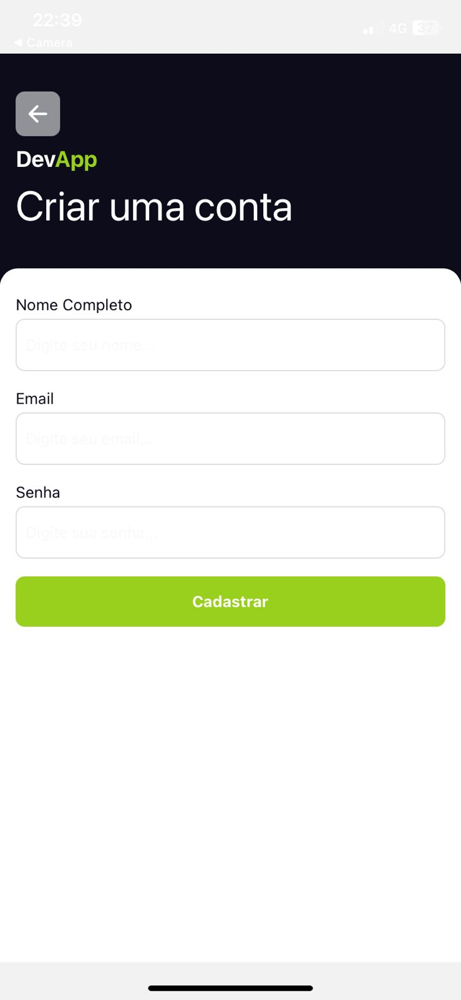

  <h3>Autenticação e Registro de Usuarios Utilizando Supabase - React Native</h3>
  

    <h2>Tela Login</h2>
    
  

  

    <h2>Tela de Cadastro</h2>
    
  

  

    <h2>Home com "E-mail" do Usuário - Pra certificar acesso</h2>
    
  

  
O sistema conta com Async Storage do supabase, para garantir que o usuário não tenha que logar novamente

